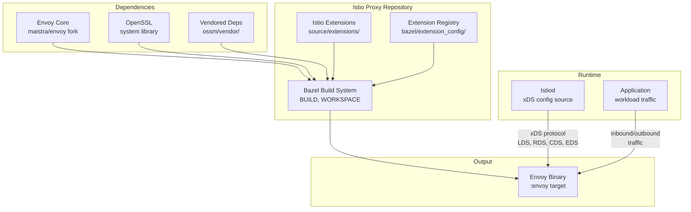

# Architecture

This document describes the high-level architecture of the OpenShift Service Mesh midstream distribution of [Istio Proxy](https://github.com/istio/proxy). This repository builds a custom [Envoy](https://www.envoyproxy.io/) binary with Istio-specific extensions for telemetry, metadata exchange, and workload discovery, using OpenSSL and vendored dependencies for offline-capable builds.

See also [ossm/README.md](ossm/README.md) for build instructions, rebase process, and version history.

## High-Level System Diagram



## Project Structure

```
proxy/
├── source/extensions/               # Istio-specific Envoy extensions (C++)
│   ├── common/
│   │   ├── hashable_string/         #   Hashable string interface (pending upstream)
│   │   └── workload_discovery/      #   Workload discovery API (proto-based)
│   └── filters/
│       ├── http/
│       │   ├── alpn/                #   ALPN protocol negotiation filter
│       │   ├── istio_stats/         #   Istio metrics and statistics filter
│       │   └── peer_metadata/       #   HTTP peer metadata extraction
│       └── network/
│           ├── metadata_exchange/   #   TCP metadata exchange protocol
│           └── peer_metadata/       #   Network-level peer metadata
│
├── bazel/                           # Bazel build configuration
│   └── extension_config/            #   Extension registry (450+ Envoy extensions)
│
├── test/envoye2e/                   # End-to-end tests (Go)
│   ├── basic_flow/                  #   Basic traffic flow tests
│   ├── stats_plugin/                #   Statistics plugin tests
│   ├── http_metadata_exchange/      #   HTTP metadata exchange tests
│   ├── tcp_metadata_exchange/       #   TCP metadata exchange tests
│   ├── workloadapi/                 #   Workload API tests
│   └── driver/                      #   Test driver framework
│
├── testdata/                        # Test fixtures
│   ├── bootstrap/                   #   Envoy bootstrap configs
│   ├── certs/                       #   Test certificates
│   ├── cluster/                     #   Cluster definitions
│   ├── listener/                    #   Listener definitions
│   └── metric/                      #   Metric config data
│
├── ossm/                            # OSSM midstream customizations
│   ├── ci/                          #   CI scripts (pre-submit, post-submit)
│   ├── patches/                     #   Platform patches (s390x, ppc64le, OpenSSL)
│   ├── scripts/                     #   Dependency update scripts
│   └── vendor/                      #   Vendored dependencies (offline build)
│
├── extensions/                      # Shared extension libraries
├── common-protos/                   # Google protobuf definitions
├── scripts/                         # Build and utility scripts
├── tools/                           # Development tools (extension-check, vscode)
├── prow/                            # Prow CI job configurations
├── .github/workflows/               # GitHub Actions (build, release, envoy update)
├── ppc64le_platform/                # PowerPC 64LE platform definition
│
├── BUILD                            # Main Bazel target (:envoy binary)
├── WORKSPACE                        # Bazel workspace (Envoy SHA, deps)
├── .bazelrc                         # Bazel configuration
├── envoy.bazelrc                    # Envoy-specific Bazel flags
├── openssl.BUILD                    # OpenSSL integration rules
├── go.mod                           # Go module (for e2e tests)
├── Makefile                         # Build entry point
├── Makefile.core.mk                 # Core build targets
└── Makefile.overrides.mk            # OSSM-specific overrides
```

## Core Components

### Envoy Binary (`BUILD`)

The primary build artifact is the `:envoy` target — an Envoy binary with all Istio extensions statically linked. It is built with Bazel using the `envoy_cc_binary` rule, combining upstream Envoy (`@envoy//source/exe:envoy_main_entry_lib`) with `ISTIO_EXTENSIONS`. OpenSSL-incompatible contrib extensions are excluded when building with OpenSSL.

Build target: `BUILD` (`:envoy`, `:envoy_tar`)

### Istio Extensions (`source/extensions/`)

C++ extensions compiled into the Envoy binary to provide Istio-specific functionality:

| Extension | Type | Purpose |
|-----------|------|---------|
| `alpn` | HTTP filter | Negotiates application-layer protocols for upstream connections |
| `istio_stats` | HTTP filter | Collects and reports Istio-specific metrics (request count, duration, size) |
| `peer_metadata` (HTTP) | HTTP filter | Extracts peer workload metadata from HTTP headers and mTLS certificates |
| `metadata_exchange` | Network filter | Exchanges workload metadata over TCP connections using an initial header protocol |
| `peer_metadata` (network) | Network filter | Extracts peer workload metadata at the network level |
| `hashable_string` | Common lib | Hashable string interface (temporary, pending upstream Envoy merge) |
| `workload_discovery` | Common lib | Workload discovery API with protobuf definitions |

### Extension Registry (`bazel/extension_config/`)

The `extensions_build_config.bzl` file registers 450+ Envoy extensions organized by category: access loggers, HTTP/network/listener/UDP filters, clusters, compression, tracers, transport sockets, DNS resolvers, and load balancing policies. It also defines `OPENSSL_INCOMPATIBLE_CONTRIB_DEPS` for extensions that cannot be built with OpenSSL (e.g., cryptomb, qat key providers).

### E2E Tests (`test/envoye2e/`)

Go-based end-to-end tests that spin up Envoy instances with test configurations and verify extension behavior. Test suites cover basic traffic flow, statistics collection, HTTP and TCP metadata exchange, and the workload API. The test driver (`test/envoye2e/driver/`) manages Envoy lifecycle and assertion checking.

## Data Flow

```
Istiod (control plane)
    │
    │  xDS protocol (ADS)
    │  LDS, RDS, CDS, EDS, SDS
    ▼
┌────────────────────────────────────────────┐
│              Envoy Binary                  │
│                                            │
│  ┌──────────────────────────────────────┐  │
│  │       Envoy Core (listeners,         │  │
│  │       routes, clusters, etc.)        │  │
│  └──────────┬───────────────────────────┘  │
│             │                              │
│  ┌──────────▼───────────────────────────┐  │
│  │       Istio Extensions               │  │
│  │                                      │  │
│  │  HTTP chain:                         │  │
│  │    peer_metadata -> istio_stats      │  │
│  │                  -> alpn             │  │
│  │                                      │  │
│  │  Network chain:                      │  │
│  │    metadata_exchange -> peer_metadata│  │
│  └──────────────────────────────────────┘  │
│                                            │
│  mTLS via OpenSSL                          │
└───────────┬────────────────────────────────┘
            │
            ▼
    Upstream services
```

Envoy receives its configuration from Istiod over xDS. Istio extensions run in the filter chain to exchange workload metadata between peers, collect telemetry metrics, and negotiate protocols. All mTLS is handled via OpenSSL (replacing upstream BoringSSL).

## Key Technologies

| Technology       | Role                                                         |
|------------------|--------------------------------------------------------------|
| C++              | Envoy core and Istio extensions                              |
| Bazel 7.7        | Build system for the Envoy binary and all dependencies       |
| Envoy            | High-performance L4/L7 proxy (maistra/envoy fork)            |
| Go               | E2E test framework and tooling                               |
| Protocol Buffers | Extension configuration and workload API definitions         |
| OpenSSL          | TLS library (replaces upstream BoringSSL)                    |
| xDS              | Discovery Service protocol for dynamic Envoy configuration   |

## Build & CI

### Building

The project builds inside a Docker container image (`quay.io/maistra-dev/maistra-builder`) that bundles Bazel, Clang, Go, and all required tooling.

```bash
docker run --rm -it \
    -v $(pwd):/work \
    -u $(id -u):$(id -g) \
    --entrypoint bash \
    quay.io/maistra-dev/maistra-builder:<version>

# Inside container:
./ossm/ci/pre-submit.sh    # Full build + all tests
```

Bazel disk caching is supported via the `BAZEL_DISK_CACHE` environment variable.

### CI/CD

**Prow** (`prow/`):
- `proxy-presubmit.sh` — Standard build and test
- `proxy-presubmit-asan.sh` — AddressSanitizer build
- `proxy-presubmit-tsan.sh` — ThreadSanitizer build
- `proxy-presubmit-wasm.sh` — WebAssembly extension tests
- `proxy-presubmit-release.sh` — Release binary build
- `proxy-postsubmit.sh` — Uploads artifacts and creates Istio PRs

**GitHub Actions** (`.github/workflows/`):
- `build.yaml` — PR builds
- `release.yaml` — Release artifact builds and image pushes
- `update-envoy.yaml` — Automated Envoy dependency updates
- `merge-upstream.yaml` — Upstream Istio proxy sync

### Automation Pipeline

```
PR merged in maistra/envoy
    │
    ▼  post-submit job updates vendored deps
PR created in this proxy repo (ossm/vendor/ update)
    │
    ▼  tests pass, PR merged
Post-submit jobs:
    ├── Upload binary artifacts to cloud storage
    └── Create PR in istio repo updating Proxy SHA
```

## OSSM Midstream Customizations

Key differences from upstream [istio/proxy](https://github.com/istio/proxy):

- **OpenSSL** — Replaces BoringSSL with system OpenSSL (`openssl.BUILD`, `WORKSPACE`). Extensions incompatible with OpenSSL are excluded via `OPENSSL_INCOMPATIBLE_CONTRIB_DEPS`.
- **Vendored dependencies** — All 100+ dependencies stored in `ossm/vendor/` for offline/air-gapped builds, including the maistra/envoy fork.
- **Multi-architecture support** — Patches for s390x (`ossm/patches/s390x/`) and PowerPC 64LE (`ossm/patches/ppc64le-openssl.patch`, `ppc64le_platform/`).
- **maistra/envoy fork** — Uses [maistra/envoy](https://github.com/maistra/envoy/) instead of upstream envoyproxy/envoy, with OpenSSL integration and additional platform support.
- **Build configuration** — Custom Bazel flags in `ossm/bazelrc` and `Makefile.overrides.mk`.
- **CI infrastructure** — OSSM-specific CI scripts in `ossm/ci/` using the maistra-builder Docker image.

## Glossary

| Term                   | Definition                                                                              |
|------------------------|-----------------------------------------------------------------------------------------|
| **ALPN**               | Application-Layer Protocol Negotiation - TLS extension for protocol selection           |
| **ADS**                | Aggregated Discovery Service - single xDS stream for all resource types                 |
| **Bazel**              | Build system used to compile Envoy and all dependencies                                 |
| **BoringSSL**          | Google's OpenSSL fork used by upstream Envoy (replaced by OpenSSL in this repo)         |
| **Envoy**              | High-performance C++ proxy that forms the data plane of Istio                           |
| **Metadata exchange**  | Protocol for sharing workload identity and attributes between Envoy proxies             |
| **OpenSSL**            | Open-source TLS library used instead of BoringSSL for FIPS and platform compatibility   |
| **OSSM**               | OpenShift Service Mesh - Red Hat's distribution of Istio for OpenShift                  |
| **Peer metadata**      | Workload attributes (name, namespace, labels) exchanged between mesh proxies            |
| **xDS**                | Discovery Service protocol family for dynamic Envoy configuration                       |
