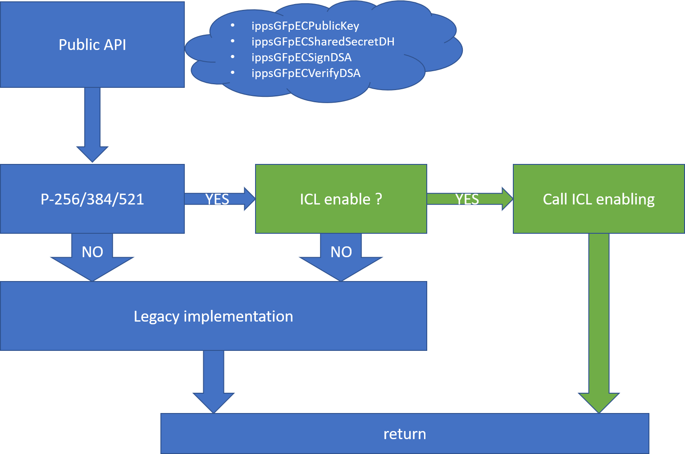

## ICL enabling of Intel® Integrated Performance Primitives Cryptography (Intel® IPP Cryptography) ECDH, ECDSA over NIST's Curves

### ICL Enabling
---
Implementation Elliptic Curve:
1) secp256r1
2) secp384r1
3) secp521r1
4) sm2

---

ICL enabling presented by internal implementation of following functions:
1) Low-level arithmetic GF(p/n) \[see [sources/ippcp/ecnist/ifma_arith_*.c](../../sources/ippcp/ecnist) and [sources/ippcp/sm2/ifma_arith_*.c](../../sources/ippcp/sm2)\]
    * mul/mul dual (using AVX*-IFMA)
    * sqr/sqr dual (using AVX*-IFMA)
    * norm/norm dual (normalization after all operation)
    * lnorm/lnorm dual (light normalization after add/mul ONLY)
    * inv
    * to_mont/from_mont
    * div2
    * neg
    * convert_radix64_radix52/convert_radix52_radix64
2) Group operation \[see [sources/ippcp/ecnist/ifma_ecpoint_*.c ](../../sources/ippcp/ecnist) and [sources/ippcp/sm2/ifma_ecpoint_*.c ](../../sources/ippcp/sm2)\]
    * dbl (double point)
    * add (add point)
    * add_affine (add affine point)
    * to_affine (affine coordinate x and/or y)
    * is_on_curve (check point in curve)
3) Field operation - using [windowed method](https://en.wikipedia.org/wiki/Elliptic_curve_point_multiplication)
    * mul (mul point by scale)
        * p256r1 - window size 5
        * p358r1 - window size 5
        * p521r1 - window size 5
        * sm2    - window size 5
    * mul_base (mul BASE point by scale)
        * p256r1 - window size 7
        * p384r1 - window size 4
        * p521r1 - window size 4
        * sm2    - window size 7
4) DSA signing/verification and DH

All the function has special hardcoded instance targeted on implementation of NIST P-256/384/521 operations.

~~~
Developer shall pay special attention to normalizing data before multiplication (or operation based on multiplication).
~~~

---

More deeply in enabling:
1) AVX*-IFMA - using in multiplication
2) Radix 2^52 (when calculating \*madd52\* - you need to have a representation in the 52 radix)
3) Algorithm Gueron Modification Group Operation ( Shay Gueron (2002). Enhanced Montgomery Multiplication. In Cryptographic Hardware and Embedded Systems - CHES 2002, 4th International Workshop, Redwood Shores, CA, USA, August 13-15, 2002, Revised Papers (pp. 46-56) [ DOI: 10.1007/3-540-36400-5_5 ] ). New approach that was applied can be found in Chapter 4 of this paper (Choosing s for a Chain of Operations in Zn).

### APIs
---
Selected Legacy APIs
```c
/* keys */
IPPAPI(IppStatus, ippsGFpECPublicKey,(const IppsBigNumState* pPrivate,
                                      IppsGFpECPoint* pPublic,
                                      IppsGFpECState* pEC,
                                      Ipp8u* pScratchBuffer))

/* DH shared secret */
IPPAPI(IppStatus, ippsGFpECSharedSecretDH,(const IppsBigNumState* pPrivateA,
                                           const IppsGFpECPoint* pPublicB,
                                           IppsBigNumState* pShare,
                                           IppsGFpECState* pEC,
                                           Ipp8u* pScratchBuffer))
IPPAPI(IppStatus, ippsGFpECSharedSecretDHC,(const IppsBigNumState* pPrivateA,
                                            const IppsGFpECPoint* pPublicB,
                                            IppsBigNumState* pShare,
                                            IppsGFpECState* pEC,
                                            Ipp8u* pScratchBuffer))

/* sign generation/verification of DSA */
IPPAPI(IppStatus, ippsGFpECSignDSA,(const IppsBigNumState* pMsgDigest,
                                    const IppsBigNumState* pRegPrivate,
                                    IppsBigNumState* pEphPrivate,
                                    IppsBigNumState* pSignR, IppsBigNumState* pSignS,
                                    IppsGFpECState* pEC,
                                    Ipp8u* pScratchBuffer))
IPPAPI(IppStatus, ippsGFpECVerifyDSA,(const IppsBigNumState* pMsgDigest,
                                      const IppsGFpECPoint* pRegPublic,
                                      const IppsBigNumState* pSignR, const IppsBigNumState* pSignS,
                                      IppECResult* pResult,
                                      IppsGFpECState* pEC,
                                      Ipp8u* pScratchBuffer))

IPPAPI(IppStatus, ippsGFpECAddPoint,(const IppsGFpECPoint* pP,
                                     const IppsGFpECPoint* pQ,
                                     IppsGFpECPoint* pR,
                                     IppsGFpECState* pEC))
IPPAPI(IppStatus, ippsGFpECMulPoint,(const IppsGFpECPoint* pP,
                                     const IppsBigNumState* pN,
                                     IppsGFpECPoint* pR,
                                     IppsGFpECState* pEC,
                                     Ipp8u* pScratchBuffer))
```
Arguments:
* pPrivate/pRegPrivate - private/secret key
* pPublic - public key
* pEphPrivate - ephemeral private key
* pSignR,pSignS - signature R | S
* pResult - the result: ippECValid/ippECInvalidSignature
* pMsgDigest - message representative to be signed
* pEC - pointer to Elliptic Curve context
* pScratchBuffer - buffer
---

### The pEC context serves as for arbitrary as for the fixed (in this case - NIST's) curves.

Special initializations
```c
IPPAPI(IppStatus, ippsGFpECInitStd256r1,(const IppsGFpState* pGFp, IppsGFpECState* pEC))
IPPAPI(IppStatus, ippsGFpECInitStd384r1,(const IppsGFpState* pGFp, IppsGFpECState* pEC))
IPPAPI(IppStatus, ippsGFpECInitStd521r1,(const IppsGFpState* pGFp, IppsGFpECState* pEC))
```
provides initialization (setup p, a, b, G(x | y), n and h EC's parameters) as defined for specific NIST-P256/384/521 EC'scalars.

---

Optional initializations:
```c
IPPAPI(IppStatus, ippsGFpECBindGxyTblStd256r1,(IppsGFpECState* pEC))
IPPAPI(IppStatus, ippsGFpECBindGxyTblStd384r1,(IppsGFpECState* pEC))
IPPAPI(IppStatus, ippsGFpECBindGxyTblStd521r1,(IppsGFpECState* pEC)
IPPAPI(IppStatus, ippsGFpECBindGxyTblStdSM2,(IppsGFpECState* pEC))

```
pointers to pre-computed [s]G tables value

### Possible interaction of public API and ICL enabling
**Main feature: application will not change neither sequence call no change parameters.**



### Testing
Testing of public API - regular testing (using platform k1+)

Testing done:
* Functional tests of low-level arithmetic (cross-check with OpenSSL on random data):
    * P (prime) operation - mul/sqr/div2/inv
    * N (order of the subgroup) operation – mul/sqr/inv

    [see tests\ippcp\apps\not_release\vfy_ifma_ec_arith_low_level_*.cpp]
* Functional tests of group operation (cross-check with OpenSSL on random data) :
    * double point
    * add point
    * add point affine
    * mul scale point
    * mul scale base point

    [see tests\ippcp\apps\not_release\vfy_ifma_ec_point_*.cpp]
* KAT vectors
* Wycheproof project test vectors, see:
    * tests\ippcp\conformance\src\ta_wycheproof_ecdh_ecdh_*.cpp
    * tests\ippcp\conformance\src\ta_wycheproof_ecdsa_ecdsa_*.cpp

