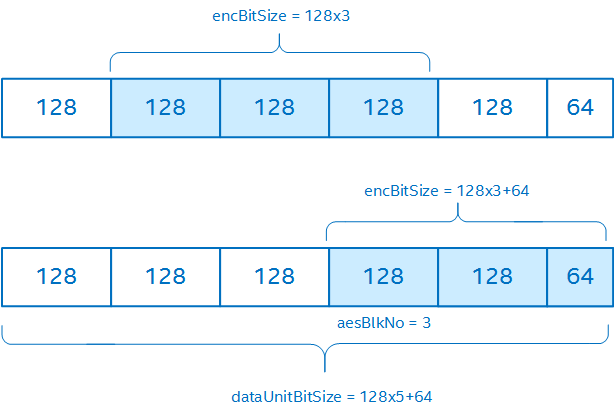

.. _aesencryptxts_direct-aesdecryptxts_direct:

AESEncryptXTS_Direct, AESDecryptXTS_Direct
==========================================

Encrypts/decrypts a data buffer in the XTS mode.

Syntax
------

IppStatus ippsAESEncryptXTS_Direct(const Ipp8u\* pSrc, Ipp8u\* pDst, int
encBitSize, int aesBlkNo, const Ipp8u\* pTweakPT, const Ipp8u\* pKey,
int keyBitSize, int dataUnitBitSize);

IppStatus ippsAESDecryptXTS_Direct(const Ipp8u\* pSrc, Ipp8u\* pDst, int
encBitSize, int aesBlkNo, const Ipp8u\* pTweakPT, const Ipp8u\* pKey,
int keyBitSize, int dataUnitBitSize);

Include Files
-------------

``ippcp.h``

Parameters
----------

.. list-table::
   :header-rows: 0

   * - pSrc
     - Pointer to the input (plain- or cipher-text) data buffer.
   * - pDst
     - Pointer to the output (cipher- or plain-text) data buffer.
   * - encBitSize
     - Length of the input data being encrypted or decrypted, in bits. The
       output data length is equal to the input data length.
   * - aesBlkNo
     - The sequential number of the first plain- or cipher-text block for operation inside the data unit.
   * - pTweakPT
     - Pointer to the little-endian 16-byte array that contains the tweak
       value assigned to the data unit being encrypted/decrypted.
   * - pKey
     - Pointer to the XTS-AES key.
   * - keyBitSize
     - Size of the XTS-AES key, in bits.
   * - dataUnitBitSize
     - Size of the data unit, in bits.

Description
-----------

These functions encrypt or decrypt the input data according to the
XTS-AES mode :term:`IEEE P1619 <[IEEE P1619]>` of the
AES block cipher. The XTS-AES tweakable block cipher can be used
for encryption/decryption of sector-based storage. The XTS-AES algorithm
acts on a single **data unit** or a section within the data unit and uses
AES as the internal cipher. The length of the data unit must be 128 bits
or more. The data unit is considered as partitioned into m+1 blocks:

``T = T[0] | T[1] | … |T[m-2] | T[m-1] |T[m]``

where

-  ``m = ceil(dataUnitBitLen/128)``
-  the first m blocks ``T[0], T[1], …,T[m-1]`` areexactly 128 bits long
-  the last block T[m] is between 0 and 127 bits long(it could be empty,
   for example, 0 bits long)

The cipher processes the first (m-1) blocks ``T[0], T[1], …, T[m-2]``
independently of each other. If the last block T[m]\ *is empty*, then
the block T[m-1] is processed independently too. However, if the
last block T[m]\ *is not empty,* the cipher processes the blocks T[m-1]
and T[m] together using a *ciphertextstealing* mechanism.
See :term:`IEEE P1619 <[IEEE P1619]>` for
details.

With the Intel® Cryptography Primitives Library implementation of XTS-AES,
you can select a sequence of adjacent data blocks (section) within the data
unit for processing. The section you select is specified by the aesBlkNo and
encBitSize parameters.

The ciphertext stealing mechanism constrains possible section selections.
If the last block T[m] of the data unit is not empty, the section you
select must contain either bothT[m-1] and T[m] or neither of them.
Therefore, consider encBitSize, aesBlkNo, and dataUnitBitSize all
together when making a function call. The following figure shows valid
selections of a section within the data unit:

The XTS-AES block cipher uses tweak values to ensure that each data unit
is processed differently. A tweak value is a 128-bit integer
that represents the logical position of the data unit. The tweak
values are assigned to the data units consecutively, starting from
an arbitrary non-negative integer. Before calling the function, convert
the tweak value into a 16-byte little-endian array. For example, the tweak
value ``0x123456789A`` corresponds to the byte array:

.. code-block:: cpp

   Ipp8u twkArray[16] = {0x9A, 0x78, 0x56, 0x34, 0x12, 0x00, 0x00, 0x00,
                         0x00, 0x00, 0x00, 0x00, 0x00, 0x00, 0x00, 0x00}.

The key for XTS-AES is parsed as a concatenation of two fields of equal
size, called data key and tweak key, so that
``key = data key|tweakkey``.

where

* data key is used for data encryption/decryption
* tweak key is used for encryption of the tweak value

The standard allows only AES128 and AES256keys.

Refer to :term:`IEEE P1619 <[IEEE P1619]>` for more details.

Return Values
-------------

.. list-table::
   :header-rows: 0

   * - ippStsNoErr
     - Indicates no error. Any other value indicates an error or warning.
   * - ippStsNullPtrErr
     - Indicates an error when any of the specified pointers is NULL.
   * - ippsStsLengthErr
     - Indicates an error condition when: dataUnitBitsize < 128 or keyBitsize != 256 or 512
   * - ippStsBadArgErr
     - | aesBlkNo >= dataUnitBitsize/IPP_AES_BLOCK_BITSIZE or aesBlkNo < 0
       | **[Only in FIPS-compliance mode]** Indicates an error condition if tweak key is equal to the data keys (Key1 == Key2).
   * - ippsStsBadArgErr
     - Indicates an error when:
