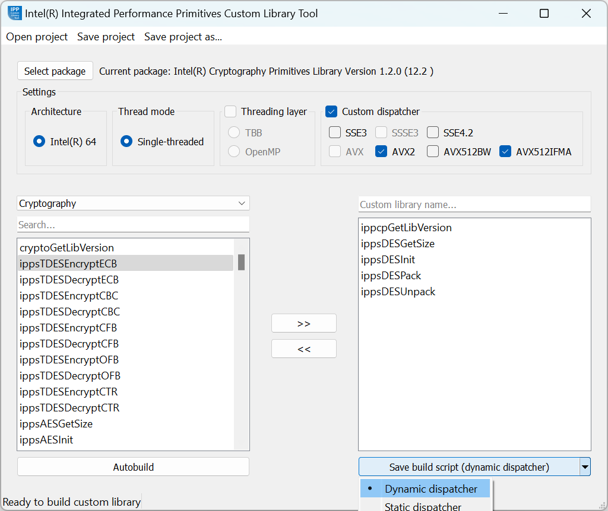

.. _building-a-custom-dll-with-custom-library-tool:

Building a Custom DLL with Custom Library Tool
==============================================

Follow the steps below to build a custom dynamic library using the
Intel® Integrated Performance Primitives (Intel® IPP) Custom Library Tool:

#. Run :samp:`python main.py` to launch the GUI version of the tool.
#. Select the Intel® Cryptography Primitives Library package.
#. Configure your custom library.
#. Set the library name.
#. Select functions from the list. You can build a dynamic library
   containing Intel® Integrated Performance Primitives (Intel® IPP)
   or Intel® Cryptography Primitives Library functionality,
   but not both. If you need to add threaded functions to the custom list,
   select the **Threading layer** checkbox to show the list of threaded
   functions.
#. Build the library automatically (if available) or save a build
   script.

.. note::

   You can save the configuration and the list of custom functions as a
   project by selecting **Save project** or **Save project as...**. The
   project is saved as a file with the .cltproj extension. You can then
   open the project by selecting **Open project**.

