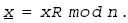
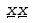
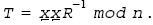
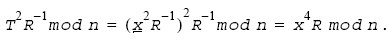

.. _montgomery-reduction-scheme-functions:

Montgomery Reduction Scheme Functions
=====================================

This section describes Montgomery reduction scheme functions.

Montgomery reduction is a technique for efficient implementation of
modular multiplication without explicitly carrying out the classical
modular reduction step.

This section describes functions for Montgomery modular reduction,
Montgomery modular multiplication, and Montgomery modular
exponentiation.

Let n be a positive integer, and let R and T be integers such that R >
n, gcd (n, R)= 1, and 0 < T < nR. The Montgomery reduction of T modulo n
with respect to R is defined as TR - 1 mod n.

For better results, functions included in the cryptography package use R
= b\ :sup:`k` where b = 2\ :sup:`32` and k is the Montgomery index
integer computed by the ceiling function of the bit length of the
integer n over 32.

All functions use employ the context IppsMontState to serve as an
operational vehicle to carry the Montgomery reduction index k, the
integer big number modulus n, the least significant word n0 of the
multiplicative inverse of the modulus n with respect to the Montgomery
reduction factor R, and a sufficient working buffer reserved for various
Montgomery modular operations.

Furthermore, two new terms are introduced in this section:

-  length of the context IppsMontState is defined as the data length of
   the modulus n carried by the structure
-  size of the context IppsMontState is therefore defined as the maximum
   data length of such an integer modulus n that could be carried by
   this operational vehicle.

The following example can briefly illustrate the procedure of using the
primitives described in this section to compute a classical modular
exponentiation T = x\ :sup:`e` mod n. Consider computing T = x\ :sup:`4`
mod n, for some integer x with 0 < x < n.

First get the buffer size required to configure the context
IppsMontState by calling
:ref:`MontGetSize <montgetsize>`
and then allocate the working buffer using OS service function, with
allocated buffer to call
:ref:`MontInit <montinit>`
to initialize the context IppsMontState.

Set the modulus n by
calling\ :ref:`MontSet <montset>`
and then convert x into its respective Montgomery form by calling
:ref:`MontForm <montform>`,
that is, computing
|image1|

Then compute the Montgomery reduction of
|image2|
using the function
:ref:`MontMul <montmul>`
to generate
|image3|
The Montgomery reduction of T\*Tmod n with respect to R is
|image4|

Further applying
:ref:`MontMul <montmul>`
with this value and the value of 1 yields the desired result T =
x\ :sup:`4`\ mod n.

The classical modular exponentiation should be computed by performing
the following sequence of operations:

#. Get the buffer size required to configure the context IppsMontState
   by calling the function
   :ref:`MontGetSize <montgetsize>`.
   For limited memory system, choose binary method, and otherwise,
   choose sliding window method. Using the binary method reduces the
   buffer size significantly while using sliding window method enhances
   the performance.
#. Allocate working buffer through an operating system memory allocation
   function and configure the structure IppsMontState by calling the
   function
   :ref:`MontInit <montinit>`
   with the allocated buffer and the choice made on the modular
   exponential method at time invoking
   :ref:`MontGetSize <montgetsize>`.
#. Call the function
   :ref:`MontSet <montset>`
   to set the integer big number module for IppsMontState.
#. Call the function
   :ref:`MontForm <montform>`
   to convert the integer x to be its Montgomery form.
#. Call the
   function\ :ref:`MontExp <montexp>`
   to compute the Montgomery modular exponentiation.
#. Call the function
   :ref:`MontMul <montmul>`
   to compute the Montgomery modular multiplication of the above result
   with the integer 1 as to convert the above result back to the desired
   classical modular exponential result.
#. Clean up secret data stored in the context.
#. Free the memory using an operating system memory free function, if
   needed.

.. rubric:: Related Information

:ref:`data-security-considerations`

.. toctree::
   :maxdepth: 1

   montgetsize
   montinit
   montset
   montget
   montform
   montmul
   example-using-montgomery-reduction-scheme
   montexp
