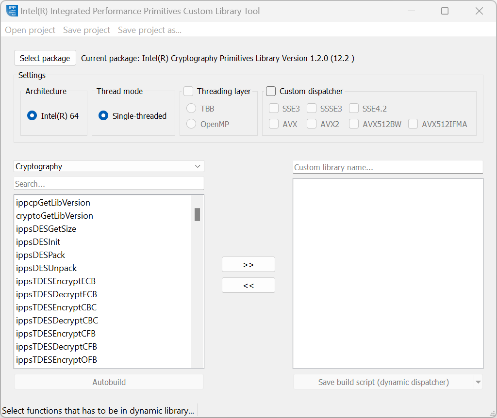

.. _operation-modes:

Operation Modes
===============

The Custom Library Tool (CLT) has two operation modes:

- **Auto build**. The tool automatically sets the environment and
  builds a dynamic library.
- **Save script**. The tool generates and saves a custom build
  script using one of two dispatchers:

  - **Dynamic dispatcher** (default): Library initialization happens before a call of any custom dispatcher function:

    - Manually when generating a custom dispatcher script without building a custom library.
    - In dynamic/shared library initialization function (generated automatically by CLT) when building a custom library.
  
  - **Static Dispatcher**: Enables custom dispatcher functions to initialize a library (if it hasn’t been initialized yet) before the call of the dispatched function.

