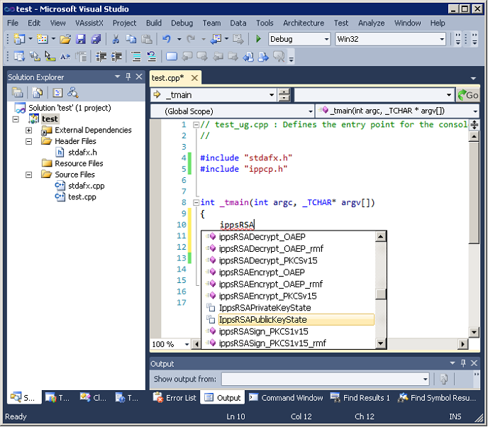
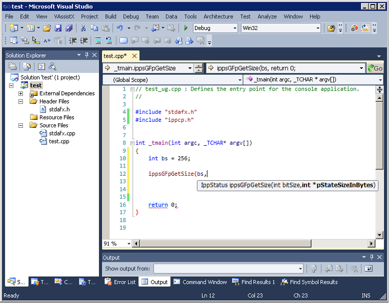

.. _using-the-intellisense-features:

Using the IntelliSense\* Features
=================================

Intel® Cryptography Primitives Library supports two Microsoft\* Visual Studio
IntelliSense\* features that support language references: `Complete
Word <#complete-word>`__ and `Parameter Info <#parameter-info>`__.

.. note::

   Both features require header files. Therefore, to benefit from
   IntelliSense, make sure the path to the include files is specified in
   the Visual Studio solution settings. On how to do this, see :ref:`Linking
   Your Microsoft\* Visual Studio\* Project with Intel® Cryptography Primitives Library
   <linking-visual-studio-project-with-crypto-primitives-library>`.

.. _complete-word:

Complete Word
-------------

For a software library, the *Complete Word* feature types or prompts for
the rest of the name defined in the header file once you type the first
few characters of the name in your code.

Provided your C/C++ code contains the include statement with the
appropriate Intel® Cryptography Primitives Library header file, to complete the name of
the function or named constant specified in the header file, follow
these steps:

#. Type the first few characters of the name (for example, :samp:`ippsRSA`).

#. Press **Alt** + **RIGHT ARROW** or **Ctrl** + **SPACEBAR** If you
   have typed enough characters to eliminate ambiguity in the name,
   the rest of the name is typed automatically. Otherwise, the pop-up
   list of the names specified in the header file opens - see the
   figure below.

   |image1|

#. Select the name from the list, if needed.

.. _parameter-info:

Parameter Info
--------------

The *Parameter Info* feature displays the parameter list for a function
to give information on the number and types of parameters.

To get the list of parameters of a function specified in the header
file, follow these steps:

#. Type the function name
#. Type the opening parenthesis

A tooltip appears with the function API prototype, and the current
parameter in the API prototype is highlighted - see the figure below.

|image2|

